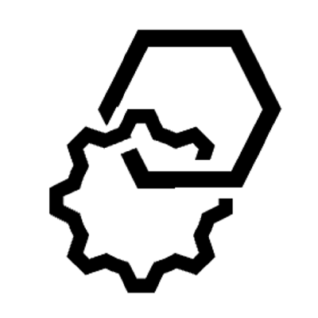

<div id="top"></div>

<!-- PROJECT SHIELDS -->
[![Contributors][contributors-shield]][contributors-url]
[![Forks][forks-shield]][forks-url]
[![Stargazers][stars-shield]][stars-url]
[![Issues][issues-shield]][issues-url]
[![MIT License][license-shield]][license-url]
[![C7][c7-shield]][c7-url]
[![C8][c8-shield]][c8-url]
<!-- END OF PROJECT SHIELDS -->

<!-- PROJECT LOGO -->
<br />
<div align="center">
    <a href="#">
        
    </a>
    <h3><a href="https://bpm-crafters.github.io/website/">BPM-Crafters Website and Documentation </a></h3>
    <p>
        <a href="https://github.com/bpm-crafters/website/issues">Report Bug</a>
        ·
        <a href="https://github.com/bpm-crafters/website/pulls">Request Feature</a>
    </p>
</div>

This repository contains the BPM-Crafters website as well as various best-practices and the api-client-documentation which can be found under [https://bpm-crafters.github.io/website/](https://bpm-crafters.github.io/website/)

## Documentation Guidelines
### PRs for every change
All changes have to be done in a separate Branch. As soon as the changes are done please open a PR. A GitHub Action runs 
with every commit to a Branch and checks if the documentation can be built. If you create a new branch make sure to name it according 
to what it does (e.g. feat/xyz or fix/xyz). Please use semantic commit messages as described in [here](https://gist.github.com/joshbuchea/6f47e86d2510bce28f8e7f42ae84c716).

### Structure
Name Markdown files according to the title. This makes it easier to find a file.
Avoid non-alphanumeric characters in titles. Use the file name as an internal document id to reference in the appropriate sidebars file.

### Style Guide 
We will be using the writing [style guide defined by Camunda](https://github.com/camunda/camunda-platform-docs/blob/main/howtos/technical-writing-styleguide.md).
It outlines writing techniques and practices to ensure uniform styling across documentation and to yield a more cohesive and organized user experience.

## Setup
### Installation 
`npm install`

### Local Development 
`npm run start`

### Troubleshooting Checklist
Have you pulled latest from `main`?
Have you run npm install? When we update dependencies in the project, they don't automatically get updated in your environment.
You'll need to run npm install occasionally to acquire dependency updates locally.

### Creating new files 
If you have created a new file for the documentation you always need to make sure that it contains a proper header: 
```
---
id: best-practices-overview
title: Best Practices Overview
sidebar_label: Overview
description: "This section provides an overview of the different BPM Best Pracitces."
---
```
If the page should show up in the sidebar it needs to be added to the [sidebar.js](./sidebars.js). By default, this should always be the case. 

## Configuration
This documentation is built using [Docusaurus 3](https://docusaurus.io), a modern static website generator.
The framework is well documented and is used by many (open source) projects.
The documentation can be customized by setting parameters in docusaurus.config.js. Parameters are described here: https://v2.docusaurus.io/docs/docusaurus.config.js.


<!-- MARKDOWN LINKS & IMAGES -->
<!-- https://www.markdownguide.org/basic-syntax/#reference-style-links -->
[contributors-shield]: https://img.shields.io/github/contributors/bpm-crafters/website.svg?style=for-the-badge
[contributors-url]: https://github.com/bpm-crafters/website/graphs/contributors

[forks-shield]: https://img.shields.io/github/forks/bpm-crafters/website.svg?style=for-the-badge
[forks-url]: https://github.com/bpm-crafters/website/network/members

[stars-shield]: https://img.shields.io/github/stars/bpm-crafters/website.svg?style=for-the-badge
[stars-url]: https://github.com/bpm-crafters/website/stargazers

[issues-shield]: https://img.shields.io/github/issues/bpm-crafters/website.svg?style=for-the-badge
[issues-url]: https://github.com/bpm-crafters/website/issues
